# mte_analysis

## Hypothesis

I'm testing the [MTE API Relay](https://github.com/Eclypses/mte-relay-server) from [Eclypses](https://eclypses.com/).

There is a `clientIdSecret` field in the config. [Jeff Dance](https://www.linkedin.com/in/jefferson-dance-7b678126/) told me that the secret is only used for the initial connection and then the connection is stateful and the secret is irrelevant.

Let's begin.

## Setup Details

### Alice

Using authenticated Azure CLI running in a Windows 11 terminal

Create resource group A

```az group create --name resource_group_a --location uksouth```

Create Azure Container Registry A

```az acr create --resource-group resource_group_a --name acralice --sku Basic```

Push the alice app to the registry

```az acr build --registry acralice --image alice/alice:latest .\github\mte_analysis\alice\```

Check that alice is there

```az acr repository list --name acralice --output table```

Create the Azure Kubernetes Cluster (AKS) for alice

```az aks create --resource-group resource_group_a --name AliceCluster --node-count 2 --generate-ssh-keys --attach-acr acralice```

[!WARNING]
I had to register the `Microsoft.ContainerService` in `Subscription > Settings > Resource providers` to get this to work.

Connect to alice's AKS with kubectl

```az aks get-credentials --resource-group resource_group_a --name AliceCluster```

Verify connection

```kubectl get nodes```

Get the login server address for the ACR. Mine is `acralice.azurecr.io`, you'll need to update wherever I've used this if yours is different

```az acr list --resource-group resource_group_a --query "[].{acrLoginServer:loginServer}" --output table```

### Bob

Using authenticated Azure CLI running in a Windows 11 terminal

Create resource group B

```az group create --name resource_group_b --location uksouth```

Create Azure Container Registry B

```az acr create --resource-group resource_group_b --name acrbob --sku Basic```

Push the bob app to the registry

```az acr build --registry acrbob --image bob/bob:latest .\github\mte_analysis\bob\```

Check that bob is there

```az acr repository list --name acrbob --output table```

Create the Azure Kubernetes Cluster (AKS) for bob

```az aks create --resource-group resource_group_b --name BobCluster --node-count 2 --generate-ssh-keys --attach-acr acrbob```

Connect to bob's AKS with kubectl

```az aks get-credentials --resource-group resource_group_b --name BobCluster```

Verify connection

```kubectl get nodes```

Get the login server address for the ACR. Mine is `acrbob.azurecr.io`, you'll need to update wherever I've used this if yours is different

```az acr list --resource-group resource_group_b --query "[].{acrLoginServer:loginServer}" --output table```

## Without MTE

```mermaid
architecture-beta
    group rga(cloud)[resource_group_a]
    group rgb(cloud)[resource_group_b]

    service alice(internet)[alice] in rga

    service bob(internet)[bob] in rgb

    service user(mdi:user)[user]

    alice:B-->T: bob
    user:T-->R: alice
    user:B-->R: bob
```

### Alice specific setup

Make sure your terminal's present working directory is `alice`

Connect to alice's AKS with kubectl

```az aks get-credentials --resource-group resource_group_a --name AliceCluster```

Deploy the alice applicationn

```kubectl apply -f .\deployment_normal.yaml```

Check the deployment is succesful

```kubectl get pods```

Get the external IP address for the alice application

```kubectl get service alice-service-normal --watch```

Browse to the `EXTERNAL-IP` that is shown there

### Bob specific setup

Make sure your terminal's present working directory is `bob`

Connect to bob's AKS with kubectl

```az aks get-credentials --resource-group resource_group_b --name BobCluster```

Update the IP address in the [deployment_normal.yaml](bob/deployment_normal.yaml) to Alice's external IP address from before

Deploy the bob application

```kubectl apply -f .\deployment_normal.yaml```

Check the deployment is successful

```kubectl get pods```

Get the external IP address for the bob application

```kubectl get service bob-service-normal --watch```

Browse to the `EXTERNAL-IP` that is shown there

### Operation

If you browse to Bob's external IP and see something like the current time and a message then the deployment is working.

### Teardown

Connect to alice's AKS with kubectl

```az aks get-credentials --resource-group resource_group_a --name AliceCluster```

Stop and remove the Alice container instances

```kubectl delete -f alice/deployment_normal.yaml```

Connect to bob's AKS with kubectl

```az aks get-credentials --resource-group resource_group_b --name BobCluster```

Stop and remove the bob container instances

```kubectl delete -f bob/deployment_normal.yaml```



## With MTE

```mermaid
architecture-beta
    group rga(cloud)[resource_group_a]
    group rgb(cloud)[resource_group_b]

    service alice(internet)[alice] in rga
    service mte_a(server)[mte_a] in rga

    service bob(internet)[bob] in rgb
    service mte_b(server)[mte_b] in rgb

    service user(mdi:user)[user]

    alice:B-->T: mte_a
    mte_a:B-->T: mte_b
    mte_b:B-->T: bob
    user:T-->R: alice
    user:B-->R: bob
```

### Alice specific setup

Make sure your terminal's present working directory is `alice`

Connect to alice's AKS with kubectl

```az aks get-credentials --resource-group resource_group_a --name AliceCluster```

Deploy the alice applicationn

```kubectl apply -f .\deployment_mte.yaml```

Check the deployment is succesful

```kubectl get pods```

Get the external IP address for the MTE application

```kubectl get service mte-relay-service --watch```

Browse to the `EXTERNAL-IP` that is shown there. You'll get the `Missing required header` error



