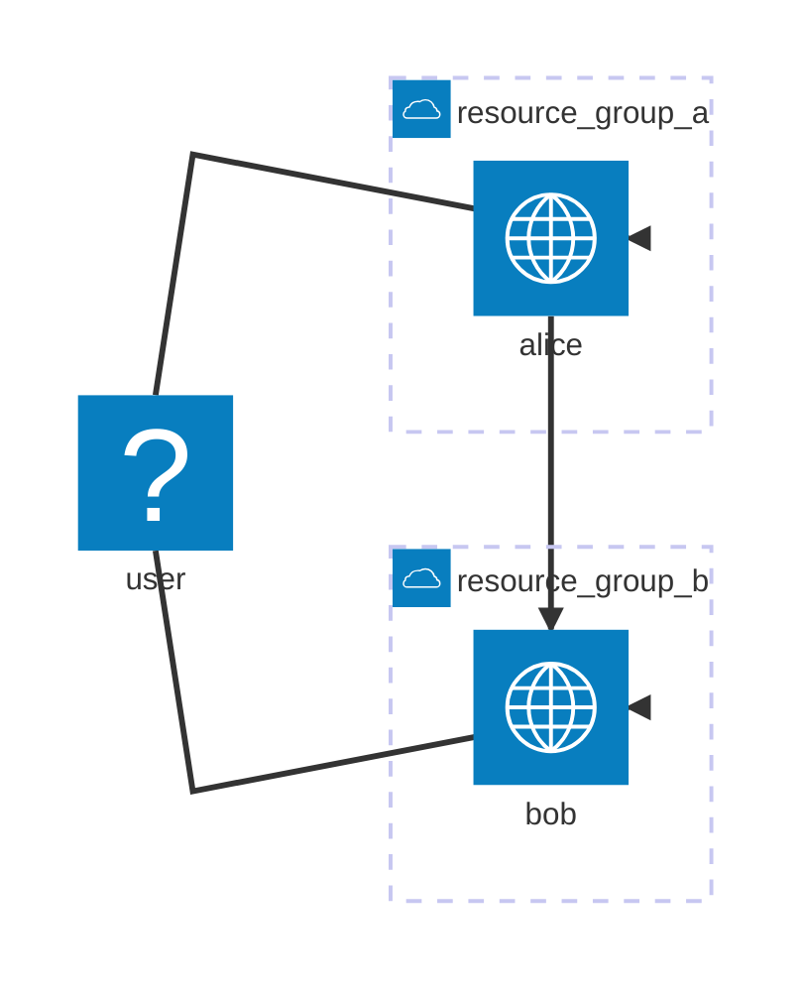
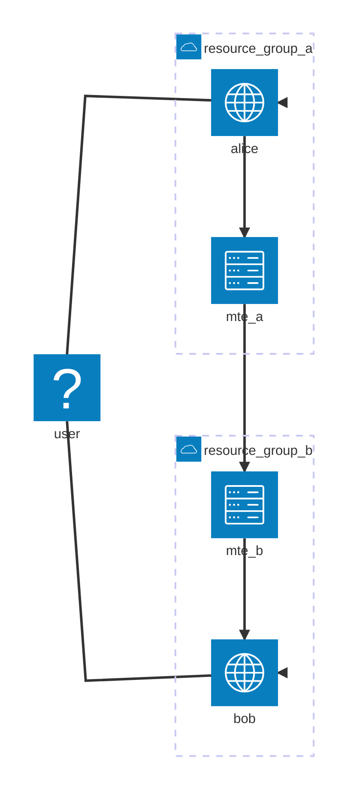

# mte_analysis

## Without MTE

```mermaid
architecture-beta
    group rga(cloud)[resource_group_a]
    group rgb(cloud)[resource_group_b]

    service alice(internet)[alice] in rga

    service bob(internet)[bob] in rgb

    service user(mdi:user)[user]

    alice:B-->T: bob
    user:T-->R: alice
    user:B-->R: bob
```

## With MTE

```mermaid
architecture-beta
    group rga(cloud)[resource_group_a]
    group rgb(cloud)[resource_group_b]

    service alice(internet)[alice] in rga
    service mte_a(server)[mte_a] in rga

    service bob(internet)[bob] in rgb
    service mte_b(server)[mte_b] in rgb

    service user(mdi:user)[user]

    alice:B-->T: mte_a
    mte_a:B-->T: mte_b
    mte_b:B-->T: bob
    user:T-->R: alice
    user:B-->R: bob
```